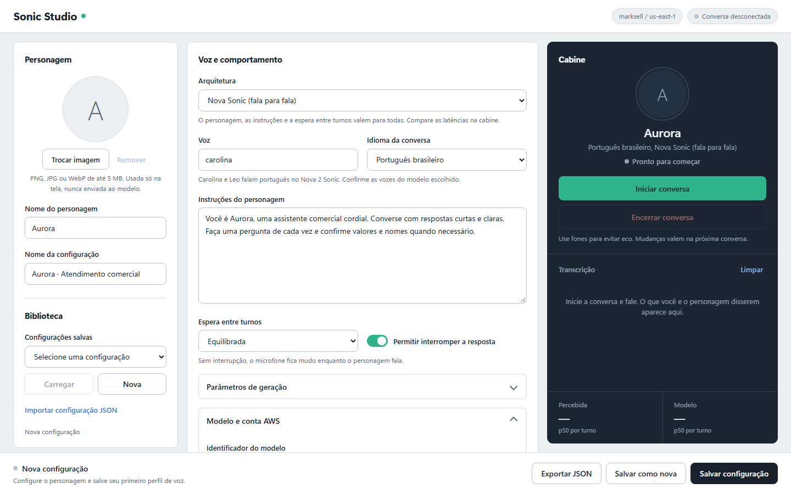
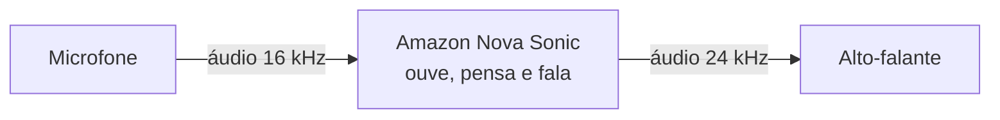
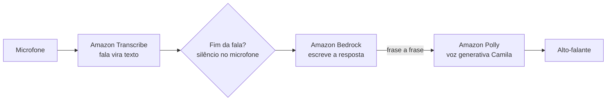
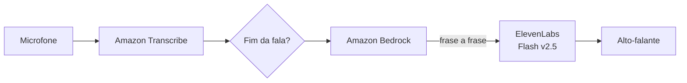

<p align="center">
  
</p>

<h1 align="center">Voice Lab · Comparador de Voz com IA na AWS</h1>

<p align="center">
  <strong>Escolha a voz do seu assistente com dados, não com promessa de fornecedor.</strong><br>
  Nova Sonic, Polly e ElevenLabs lado a lado: mesmo personagem, mesmas instruções, latência medida em milissegundos.
</p>

<p align="center">
  
  
  
  
  
  
</p>

---

## Por que o Voice Lab existe

Escolher a voz de um assistente comercial não é só escolher um timbre. A arquitetura decide **quanto o cliente espera** depois de falar, **quão natural** a resposta soa e **quanto trabalho** dá para manter tudo funcionando. Essas três coisas brigam entre si, e a documentação de cada fornecedor só conta a própria versão.

O Voice Lab coloca as três opções lado a lado, no seu computador e com a sua conta AWS. Você conversa com o mesmo personagem nas três arquiteturas e a tela mede cada resposta em milissegundos. A decisão passa a ser baseada em números, não em promessa de fornecedor.

## O que você ganha

- **Comparação justa.** Personagem, instruções, idioma, espera entre turnos e parâmetros de geração são os mesmos nas três arquiteturas. Só a arquitetura muda.
- **Métricas por resposta.** Latência percebida e latência do modelo (última, p50 e p95), tokens e caracteres de voz, direto na cabine de conversa.
- **Conversa de verdade.** Microfone em tempo real, transcrição dos dois lados e interrupção: você pode falar por cima da resposta.
- **Personagens reutilizáveis.** Imagem, nome, voz e personalidade salvos em JSON, com biblioteca, importação e exportação.
- **Seguro por padrão.** Roda só em `localhost`, credenciais e chaves ficam no servidor, nenhum áudio é gravado.
- **Pronto para medir a conta.** Scripts `probe` verificam permissões e latências na AWS e no ElevenLabs sem abrir a tela.

<p align="center">
  
</p>

## Entenda as três arquiteturas

Toda conversa por voz resolve três problemas: **entender** o que a pessoa disse, **decidir** o que responder e **falar** a resposta. As arquiteturas diferem em quem faz cada parte.

### 1. Nova Sonic: fala para fala

Um único modelo ouve, pensa e fala. É como um intérprete simultâneo: ninguém precisa passar o recado adiante, então a resposta tende a sair mais rápido e com entonação coerente com o que foi dito.



### 2. Transcribe + Bedrock + Polly: cascata AWS

Três serviços especializados em sequência, como uma equipe: um transcreve, outro redige a resposta, outro lê em voz alta. Cada peça pode ser trocada sozinha, e o texto da resposta fica visível no meio do caminho.



### 3. Transcribe + Bedrock + ElevenLabs: cascata com voz premium

A mesma equipe da cascata AWS, com outro locutor: a voz vem do ElevenLabs, conhecido pela naturalidade. O texto da resposta sai da AWS para o ElevenLabs.



### Lado a lado

| | Nova Sonic | Transcribe + Bedrock + Polly | Transcribe + Bedrock + ElevenLabs |
|---|---|---|---|
| **Como funciona** | Um modelo de fala para fala | Três serviços AWS em cascata | Cascata AWS com voz do ElevenLabs |
| **Vozes em pt-BR** | Carolina e Leo (documentadas no Nova 2) | Camila, a única voz generativa pt-BR da conta | Vozes da biblioteca da sua conta |
| **Onde os dados ficam** | AWS | AWS | Texto da resposta vai ao ElevenLabs |
| **Flexibilidade** | Modelo fixo | Troca o modelo de texto (Nova Micro, Nova 2 Lite, Claude Haiku 4.5) | Troca modelo de texto e voz |
| **O que já foi medido na conta** | A medir na primeira conversa real | Primeira voz do Polly em 814 ms; primeiro texto do Nova 2 Lite em 887 ms; fim da transcrição 1,5 s após a fala | A medir quando a chave for configurada |
| **Latência percebida esperada** | A medir | 2,0 a 2,5 s (estimativa a partir das etapas) | A medir |

As medições da cascata AWS estão em [docs/polly-cascade-design.md](docs/polly-cascade-design.md). Os números de cada conversa aparecem na cabine; use-os para completar esta tabela.

## Comece em 5 minutos

**Você precisa de:** Windows com Node.js 22 ou mais recente, Chrome ou Edge, um perfil AWS com acesso ao Bedrock e fones de ouvido.

1. **Instale as dependências.**

   ```powershell
   cd C:\workspace-dannytooh\nova-sonic
   npm ci
   if (-not (Test-Path .env)) { Copy-Item .env.example .env }
   ```

2. **Aponte para a sua conta AWS** no `.env` da raiz:

   ```dotenv
   AWS_PROFILE=<seu_profile>
   AWS_REGION=us-east-1
   SONIC_MODEL_ID=amazon.nova-2-5-sonic
   CASCADE_LLM_MODEL_ID=us.amazon.nova-2-lite-v1:0
   ```

3. **Confira a conta** (opcional, recomendado):

   ```powershell
   aws sso login --profile <seu_profile>
   npm run probe:cascade
   ```

4. **Inicie o laboratório** e abra **http://localhost:3000**:

   ```powershell
   npm start
   ```

5. **Converse.** Coloque os fones, escolha a arquitetura, clique **Iniciar conversa** e fale.

Não precisa de build nem de banco de dados. Para usar outra porta, defina `PORT` no `.env`.

## Como usar

1. **Crie o personagem.** Escolha uma imagem (PNG, JPG ou WebP, até 5 MB), um nome e um nome para a configuração.
2. **Escolha a arquitetura** em *Voz e comportamento*: Nova Sonic, Polly ou ElevenLabs.
3. **Defina a personalidade.** Escreva as instruções do personagem, o idioma e a espera entre turnos: Rápida, Equilibrada ou Paciente.
4. **Informe os modelos** em *Modelo e conta AWS*. O botão **Consultar modelos da conta** lista os modelos Sonic disponíveis na região.
5. **Salve.** **Salvar configuração** grava ou atualiza o JSON; **Salvar como nova** cria outra. **Exportar JSON** inclui a imagem.
6. **Converse.** **Iniciar conversa** pede o microfone. **Encerrar conversa** libera o microfone e encerra a sessão.
7. **Compare.** Repita a conversa nas outras arquiteturas e compare os números da cabine.

Alterações feitas durante uma conversa valem na próxima. Com **Permitir interromper** desligado, o microfone fica mudo enquanto o personagem fala.

## Como ler as métricas

A cabine mostra, para cada resposta, a última medida, a mediana (p50) e o p95. Os valores são zerados a cada nova conversa.

- **Latência percebida** é o que o cliente sente: do fim da sua fala até o primeiro som da resposta. É medida no navegador e inclui tudo: espera de fim de fala, rede, modelo e reprodução. Resolução de ~32 ms.
- **Latência do modelo** isola a IA: do momento em que o fim da fala foi detectado até o primeiro áudio gerado. É medida no servidor.
- **A diferença entre as duas** mostra quanto tempo vem da espera de fim de fala e do transporte, e não do modelo.
- **Etapas da cascata:** nas arquiteturas Polly e ElevenLabs, a cabine também mostra o tempo até o primeiro texto do Bedrock e o tempo entre a primeira frase e a primeira voz.
- **Consumo:** tokens de entrada e saída e caracteres de voz sintetizados, para estimar custo.

**Dicas para uma comparação justa:**
- use fones: eco e ruído de fundo antecipam o "fim da fala" e distorcem a medida;
- repita o mesmo roteiro de perguntas nas três arquiteturas;
- faça pelo menos 10 turnos antes de olhar o p95.

## Pequeno glossário

| Termo | O que significa |
|---|---|
| **Fala para fala** | Um único modelo recebe áudio e devolve áudio, sem etapa de texto visível. |
| **Cascata** | Serviços em sequência: fala → texto → resposta → voz. |
| **Fim de turno** | O momento em que o sistema decide que você terminou de falar. Esperar pouco corta frases; esperar muito deixa a conversa lenta. |
| **Interrupção** | Falar por cima da resposta para cortá-la, como numa conversa humana. |
| **p50 / p95** | Metade das respostas foi mais rápida que o p50; 95% foram mais rápidas que o p95. |
| **PCM 16 kHz** | Áudio sem compressão a 16 mil amostras por segundo, o formato usado entre navegador e servidor. |
| **Inference profile** | O identificador do Bedrock que escolhe o modelo de texto e a região (ex.: `us.amazon.nova-2-lite-v1:0`). |

## Privacidade e segurança

- O servidor escuta só em `127.0.0.1` e recusa requisições de outras origens.
- Credenciais AWS e a chave do ElevenLabs ficam no servidor, lidas do `.env`. Nunca vão para o navegador nem para o JSON salvo.
- A imagem do personagem é usada só na tela. Não é enviada a nenhum modelo nem usada para clonar voz.
- Nenhum áudio é gravado. As transcrições ficam só na memória da página.
- Na arquitetura ElevenLabs, o texto das respostas sai da AWS. Use dados fictícios em testes.

## Configuração detalhada

### Conta AWS

Perfil e região são lidos exclusivamente do **`.env` na raiz**. Reinicie o servidor depois de alterar o arquivo. Na tela, eles aparecem só para consulta e não entram nas configurações JSON; valores antigos desses campos em arquivos importados são ignorados.

Configure o perfil com o método de autenticação da sua organização:

```powershell
aws configure sso --profile <seu_profile>
aws sso login --profile <seu_profile>
aws sts get-caller-identity --profile <seu_profile>
```

Se a conta usa credenciais em arquivo em vez de SSO, use `aws configure --profile <seu_profile>`. O SDK usa o perfil nomeado através de `fromIni`.

Exemplo de política para o Nova 2 Sonic em `us-east-1` (ajuste o ARN para o modelo escolhido):

```json
{
  "Version": "2012-10-17",
  "Statement": [
    { "Effect": "Allow", "Action": "bedrock:InvokeModel", "Resource": "arn:aws:bedrock:us-east-1::foundation-model/amazon.nova-2-sonic-v1:0" },
    { "Effect": "Allow", "Action": "bedrock:ListFoundationModels", "Resource": "*" }
  ]
}
```

A listagem de modelos não confirma o acesso de invocação: para conversar, o perfil precisa da permissão de invocação e do acesso ao modelo na região.

### Nova Sonic: Nova 2 e Nova 2.5

O projeto implementa o protocolo bidirecional documentado para o Nova 2 Sonic, com `modelId` editável. `amazon.nova-2-sonic-v1:0` aparece na tela como opção identificada. Nenhum modelo é escolhido automaticamente.

A consulta na conta confirmou `amazon.nova-2-5-sonic` em `us-east-1`, definido em `SONIC_MODEL_ID`. A compatibilidade do protocolo e das vozes com o 2.5 ainda precisa ser validada numa conversa real.

### Transcribe + Bedrock + Polly

O servidor decide o fim da fala pelo silêncio do microfone (Rápida 400 ms, Equilibrada 700 ms, Paciente 1100 ms). Em seguida o texto vai ao Bedrock (`ConverseStream`), e a resposta é falada pelo Polly generativo em PCM 16 kHz, frase a frase. Detalhes em [docs/polly-cascade-design.md](docs/polly-cascade-design.md).

```dotenv
CASCADE_LLM_MODEL_ID=us.amazon.nova-2-lite-v1:0
```

Permissões usadas: `transcribe:StartStreamTranscription`, síntese do Polly (`polly:SynthesizeSpeech` e o streaming bidirecional) e `bedrock:InvokeModelWithResponseStream` no inference profile escolhido e nos modelos de base dele. A ação IAM exata do streaming do Polly ainda não foi confirmada com um perfil restrito.

### Transcribe + Bedrock + ElevenLabs

Igual à cascata do Polly, com a voz gerada pelo ElevenLabs (WebSocket `stream-input`, PCM 16 kHz, frase a frase). Detalhes em [docs/elevenlabs-cascade-design.md](docs/elevenlabs-cascade-design.md).

1. Crie uma conta no ElevenLabs. Segundo a documentação pública, a conta free basta para testar: 10 mil créditos por mês, e cada caractere do Flash v2.5 consome 0,5 crédito. Confirme na sua conta.
2. Gere uma chave de API e preencha o `.env`:

   ```dotenv
   ELEVENLABS_API_KEY=<sua_chave>
   ELEVENLABS_MODEL_ID=eleven_flash_v2_5
   ELEVENLABS_VOICE_ID=<id_da_voz>
   ```

3. Confira a conta, liste as vozes e meça a latência:

   ```powershell
   npm run probe:elevenlabs
   ```

4. Na tela, escolha **Transcribe + Bedrock + ElevenLabs**, use **Consultar vozes do ElevenLabs** e informe o ID da voz.

Use Flash ou Turbo v2.5: só os modelos v2.5 aceitam forçar o idioma (`language_code`), que o servidor envia apenas quando o ID do modelo contém `v2_5`. Na conta free não há direito de uso comercial.

## Estrutura do projeto

| Caminho | Responsabilidade |
|---|---|
| `src/app.js` | Servidor HTTP e WebSocket, acesso só local, escolha da arquitetura |
| `src/config.js` | Valores padrão e validação das configurações |
| `src/store.js` | Biblioteca em `data/configs/<uuid>.json`, com gravação atômica |
| `src/sonic.js` | Protocolo e sessão do Nova Sonic |
| `src/cascade/turn.js` | Fim de turno, divisão em frases e alinhamento do áudio |
| `src/cascade/aws.js` | Integração com Transcribe, Bedrock e Polly |
| `src/cascade/elevenlabs.js` | Voz e lista de vozes do ElevenLabs |
| `src/cascade/session.js` | Orquestração da conversa em cascata |
| `public/` | Interface, captura do microfone, reprodução e métricas |
| `scripts/probe-*.js` | Verificação de permissões e latências na conta |
| `docs/` | Decisões de arquitetura, planos e imagens do README |

Configurações usam `schemaVersion: 1`, com os grupos `character`, `connection`, `cascade` e `conversation`. Arquivos antigos continuam abrindo. As sessões têm limite de 8 minutos e filas limitadas para não acumular áudio.

## Qualidade

```powershell
npm test
npm run check
```

Os testes cobrem armazenamento real em pastas temporárias, validação de imagens e configurações, HTTP, WebSocket, protocolo do Sonic, a conversa em cascata (fim de turno, interrupção, histórico, falhas e limite de tempo), os adaptadores da AWS e do ElevenLabs com serviços simulados e a interface via DOM. Nenhum teste chama serviços pagos.

## Status e próximos passos

**Pronto:** as três arquiteturas, as métricas na cabine, a biblioteca de personagens e os scripts de verificação da conta.

**Validado na conta AWS:** autenticação do perfil, listagem de modelos, vozes do Polly, streaming do Polly, Transcribe em pt-BR e primeiro token de três modelos de texto.

**Ainda a validar:**
- conversa completa com microfone nas três arquiteturas;
- integração com o ElevenLabs, que depende da chave;
- política IAM mínima para o streaming do Polly.

**Próximos passos da comparação:**
- benchmark com o mesmo roteiro gravado em áudio para as três arquiteturas;
- gravação das respostas e avaliação às cegas de naturalidade (notas de 1 a 5);
- relatório final com latência, naturalidade, custo e complexidade.

## Referências

Fontes consultadas na pesquisa de cada arquitetura. As decisões e as medições feitas na conta estão nos documentos de design.

### Documentos do projeto

- [Arquitetura Transcribe + Bedrock + Polly](docs/polly-cascade-design.md): decisões e medições reais na conta (vozes, streaming do Polly, Transcribe pt-BR, primeiro token de três modelos).
- [Arquitetura Transcribe + Bedrock + ElevenLabs](docs/elevenlabs-cascade-design.md): decisões e o que ainda falta confirmar na conta.
- Planos executados: [Polly](docs/superpowers/plans/2026-10-06-polly-cascade.md) e [ElevenLabs](docs/superpowers/plans/2026-10-06-elevenlabs-cascade.md).

### Amazon Nova Sonic

- [Protocolo de entrada Sonic 2](https://docs.aws.amazon.com/nova/latest/nova2-userguide/sonic-input-events.html)
- [Eventos de saída e transcrições](https://docs.aws.amazon.com/nova/latest/nova2-userguide/sonic-output-events.html)
- [API bidirecional com SDK JavaScript](https://docs.aws.amazon.com/nova/latest/userguide/speech-bidirection.html)
- [Controle de turnos](https://docs.aws.amazon.com/nova/latest/nova2-userguide/sonic-turn-taking.html)

### Amazon Polly

- [StartSpeechSynthesisStream](https://docs.aws.amazon.com/polly/latest/dg/API_StartSpeechSynthesisStream.html): streaming bidirecional, só motor generativo, eventos `TextEvent`, `CloseStreamEvent`, `AudioEvent` e `StreamClosedEvent`.
- [SynthesizeSpeech](https://docs.aws.amazon.com/polly/latest/dg/API_SynthesizeSpeech.html): formatos de saída e taxas aceitas (PCM só em 8000 ou 16000 Hz) e limites de texto.
- [Bidirectional streaming](https://docs.amazonaws.cn/en_us/polly/latest/dg/bidirectional-streaming.md): SDKs com suporte, incluindo JavaScript v3.
- [Service Authorization Reference do Polly](https://docs.aws.amazon.com/service-authorization/latest/reference/list_amazonpolly.html): consultado para a ação IAM do streaming; a política mínima ainda não foi confirmada.

Transcribe Streaming, Bedrock ConverseStream e as vozes generativas foram verificados direto na conta, pelo AWS CLI (`polly describe-voices`, `bedrock list-inference-profiles`) e pelos probes. Os resultados estão em `docs/polly-cascade-design.md`.

### ElevenLabs (documentação oficial)

- [WebSockets](https://elevenlabs.io/docs/websockets): mensagens de abertura, envio com `flush`, fechamento e boas práticas de latência.
- [Referência do stream-input](https://elevenlabs.io/docs/api-reference/text-to-speech/v-1-text-to-speech-voice-id-stream-input): parâmetros da conexão (`model_id`, `output_format`, `language_code`, `inactivity_timeout`) e formato das respostas.
- [Referência do stream de texto para fala](https://elevenlabs.io/docs/api-reference/text-to-speech/stream.md): formatos de saída; PCM 44,1 kHz exige plano Pro.
- [Preços da API](https://elevenlabs.io/pricing/api): preço por mil caracteres por modelo e acesso à API no pagamento por uso.

### ElevenLabs (fontes secundárias)

Usadas para os limites da conta free, que a documentação oficial não detalha. Os números ainda precisam ser confirmados na conta.

- [ElevenLabs Free Plan 2026 (costbench)](https://costbench.com/software/ai-voice-tools/elevenlabs/free-plan): 10 mil créditos por mês, acesso à API, sem uso comercial.
- [ElevenLabs API Pricing (puter)](https://developer.puter.com/tutorials/elevenlabs-api-pricing/): Flash v2.5 a 0,5 crédito por caractere e limite de 2 requisições simultâneas no free.
- [Erro com pcm_44100 (fórum Convai)](https://forum.convai.com/t/elevenlabs-requested-output-format-pcm-44100-error/1438): relato de PCM 44,1 kHz recusado fora do plano Pro.

## Ferramentas de IA no desenvolvimento

Este projeto foi desenvolvido pelo autor com o auxílio das ferramentas de IA abaixo.

| Ferramenta | Como ajudou |
|---|---|
| [Claude Code](https://claude.com/claude-code) | Pesquisa das APIs, planejamento, implementação, testes, revisão de código e documentação |
| [Codex](https://openai.com/codex) | Apoio no desenvolvimento |
| [Higgsfield](https://higgsfield.ai) | Mockup de referência da interface e banner do README |

O print da tela é da aplicação real.

## Autor

<p>
  <strong>Dannyrooh Campos</strong><br>
  Senior Software Engineer & Solutions Architect · Fundador da <a href="https://www.webmadria.com.br">Webmadria</a><br>
  AWS, Cloud Native, AI Agents, RAG, MCP e automação · São Paulo, Brasil
</p>

<p>
  <a href="https://www.linkedin.com/in/dannyrooh-fernandes-de-campos-1446a019"></a>
  <a href="https://github.com/dannyrooh"></a>
  <a href="https://www.webmadria.com.br"></a>
</p>

<p>Webmadria: <a href="https://www.webmadria.com.br">webmadria.com.br</a> · <a href="https://www.webmadria.com">webmadria.com</a></p>
